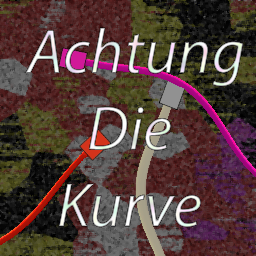
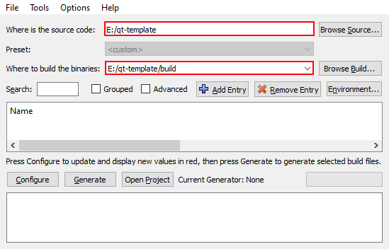
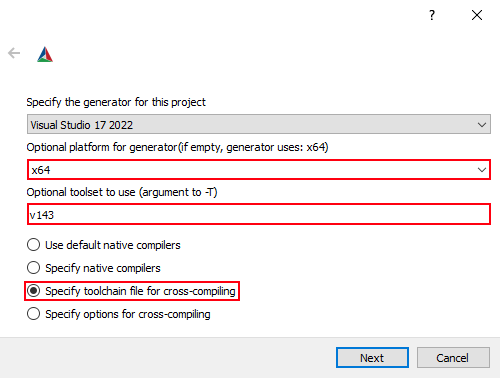
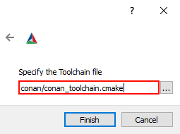

[](https://github.com/lighttab2/achtung-die-kurve/actions/workflows/macos.yml)
[](https://github.com/lighttab2/achtung-die-kurve/actions)
[](https://github.com/lighttab2/achtung-die-kurve/actions)
[](https://github.com/lighttab2/achtung-die-kurve/releases)

# Achtung Die Kurve
<p align="center">

</p>

[Cool PNGs to attract people]

[Project short info]

[Project usage example GIFs]

## Install
<details><summary>Prerequisites</summary>

* **[CMake v3.21+](https://cmake.org/)**

* **[Python 3](https://www.python.org/)**
    * **Conan** &ndash; `pip install conan`

* **[Qt 6](https://www.qt.io/)**

* **C++ compiler that can compile Qt6** &ndash; needs to support the **C++17** standard. Lists of viable compilers:
    * [Linux](https://doc.qt.io/qt-6/linux.html)
    * [Windows](https://doc.qt.io/qt-6/windows.html)
    * [macOS](https://doc.qt.io/qt-6/macos.html)

<hr>
</details>

### Install packages using *Conan*:

```bash
conan install conan/ --build=missing --settings=build_type=Debug
conan install conan/ --build=missing --settings=build_type=Release
```

### [Simply run *CMake*:](https://cmake.org/runningcmake/)

<details><summary>Bash</summary>

```bash
cmake . -G [generator] -T [toolset] --build [PathToBuiltProject]
```

Example:

```bash
cmake . -G "Visual Studio 16 2019" -T v143 -Bbuild
```

<hr>
</details>

<details><summary>GUI</summary>

The procedure is the standard one, but there are three things to be way of.

**In-source** builds are not allowed so these directories must differ:
<p align="center">

</p>

You need to provide **architecture** and **toolkit**. If you leave them blank, project **generation** will likely fail. Also select option to specify the **toolchain file**:

<p align="center">

</p>

If you did not tinker with *Conan*, the **toolchain file** should be found at `conan/conan_toolchain.cmake`. 

<p align="center">

</p>

<hr>
</details>

### Build the project

You can use your local *IDE* or *CMake* again:

```bash
cmake --build [pathToBuiltProject] --config [configuration] -j4 -DCMAKE_TOOLCHAIN_FILE=[pathToConanToolchainFile]
```

Example:

```bash
cmake --build build --config release -j4 -DCMAKE_TOOLCHAIN_FILE=conan/conan_toolchain.cmake
```

## Features
[List of features]

## Contributing

This project follows these [C++ Core Guidelines](https://isocpp.github.io/CppCoreGuidelines/CppCoreGuidelines), and it would be fun if you followed them too. If you don't, someone will correct your code. An ugly contribution is better than no contribution. **Thanks**!

## License

This project is licensed under the [CC0 1.0 Universal](https://creativecommons.org/publicdomain/zero/1.0/); see the
[LICENSE](LICENSE) file for details.
It also uses the [Qt](https://www.qt.io/) library and possibly some of its additional modules that are licensed under the [LGPL](https://www.gnu.org/licenses/lgpl-3.0.en.html), but **none** of its code is present in this repository. Also note that *Qt* itself uses [other third-party libraries](https://doc.qt.io/qt-6/licenses-used-in-qt.html) under **different** license terms.
